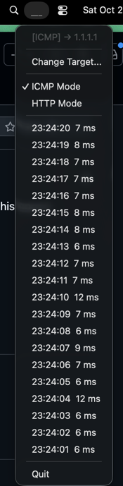

## Pinger

Small macOS menu bar utility that pings a target host on an interval and shows:

- Latest round‑trip time history as a live mini chart in the menu bar
- A dropdown of the most recent 20 samples with timestamps and latency



### Features

- **Live tray icon**: bars update every ping; color animates while a ping is in flight
- **History buffer**: keeps recent samples in a ring buffer (default 60)
- **Quick overview**: open the tray to see the last 20 results; failures are marked

### Build and run

Requirements: Go 1.22+

```bash
git clone https://github.com/nenad/pinger
cd pinger
go build -o pinger .
./pinger
```

You can also run directly:

```bash
go run .
```

### CLI flags

- `-target` (string): target address to ping. Default `1.1.1.1`.
- `-interval` (duration): ping interval. Default `1s`.
- `-timeout` (duration): ping timeout. Default `2s`.

Examples:

```bash
./pinger -target 8.8.8.8 -interval 2s -timeout 1s
```

### Notes

- Uses unprivileged ICMP via `prometheus-community/pro-bing` to avoid root requirements.
- Menu bar integration is powered by `getlantern/systray`.

### License

MIT


